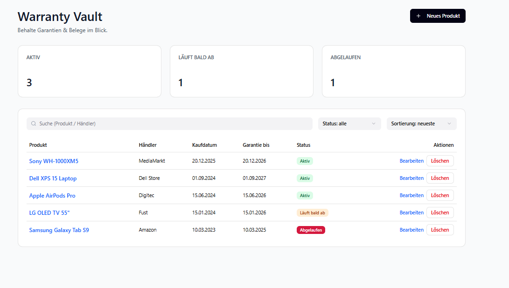
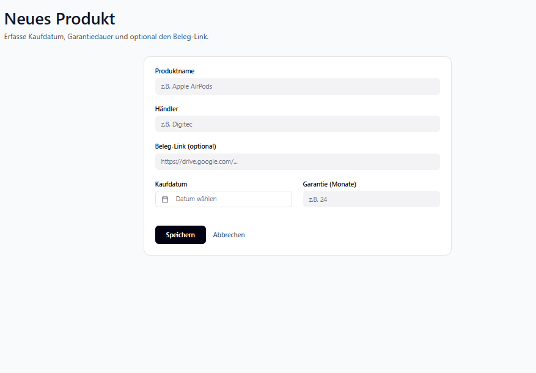
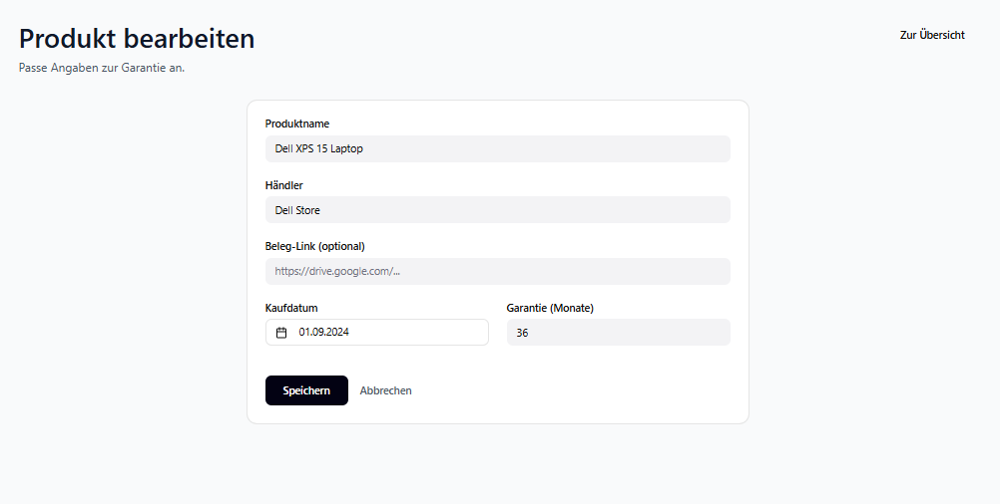
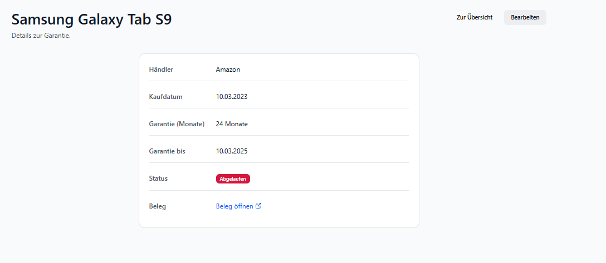

# Projektdokumentation – [Projekttitel]

## Inhaltsverzeichnis

1. [Einordnung & Zielsetzung](#1-einordnung--zielsetzung)
2. [Zielgruppe & Stakeholder](#2-zielgruppe--stakeholder)
3. [Anforderungen & Umfang](#3-anforderungen--umfang)
4. [Vorgehen & Artefakte](#4-vorgehen--artefakte)
    - [Understand & Define](#41-understand--define)
    - [Sketch](#42-sketch)
    - [Decide](#43-decide)
    - [Prototype](#44-prototype)
    - [Validate](#45-validate)
5. [Erweiterungen [Optional]](#5-erweiterungen-optional)
6. [Projektorganisation [Optional]](#6-projektorganisation-optional)
7. [KI‑Deklaration](#7-ki‑deklaration)
8. [Anhang [Optional]](#8-anhang-optional)

> **Hinweis:** Massgeblich sind die im **Unterricht** und auf **Moodle** kommunizierten Anforderungen.

<!-- WICHTIG: DIE KAPITELSTRUKTUR DARF NICHT VERÄNDERT WERDEN! -->

<!-- Diese Vorlage ist für eine README.md im Repository gedacht. Abschnitte mit [Optional] können weggelassen werden, wenn in den Übungen nichts anderes verlangt wird. -->

## 1. Einordnung & Zielsetzung
Kurz beschreiben, welches Problem adressiert wird und welches Ergebnis angestrebt ist.

- **Kontext & Problem:** _[1–3 Sätze]_  
Viele Leute verlieren den Überblick über Garantiefristen und Belege (z.B. wo gekauft, wie lange Garantie, wann läuft sie ab). Dadurch werden Rückgaben/Reparaturen unnötig kompliziert oder Fristen werden verpasst. Warranty Vault löst das, indem alle Produkte inkl. Garantie-Status zentral erfasst und übersichtlich angezeigt werden.

- **Ziele:** _[stichwortartig oder 2–4 Sätze]_  

Produkte mit Kaufdatum & Garantiedauer speichern und verwalten (CRUD).

Übersicht mit Suche, Filter (Status) und Sortierung (z.B. neueste / läuft am nächsten ab).

Automatische Berechnung & Anzeige von Garantie-Enddatum und Status (aktiv / läuft bald ab / abgelaufen).

Optional: Beleg-Link pro Produkt speichern, um Dokumente schnell zu finden.

- **Abgrenzung [Optional]:** _Was gehört explizit nicht zum Umfang?_
Kein Login/Mehrbenutzer-System, kein echter Datei-Upload (PDF/Bild), keine Anbindung an Shops/Scanner/OCR.

## 2. Zielgruppe & Stakeholder
Wem nützt die Lösung, wer ist beteiligt oder betroffen?

- **Primäre Zielgruppe:** _[kurz beschreiben]_ 
Einzelpersonen (oder kleine Haushalte), die Garantien und Belege für Produkte einfach verwalten möchten.

- **Weitere Stakeholder [Optional]:** _[z. B. Verwaltung, Geschäftsleitung]_  
Dozierende/Modulverantwortliche (Bewertung), evtl. Peers als Testnutzer.

- **Annahmen [Optional]:** _[welche Hypothesen werden geprüft?]_
Nutzer erfassen Produkte manuell.

Garantie wird vereinfacht als “X Monate ab Kaufdatum” modelliert.

Belege werden als Link (z.B. Google Drive) hinterlegt statt Upload.

## 3. Anforderungen & Umfang
Beschreibt den verbindlichen Umfang gemäss Übungen und allfällige Erweiterungen.
- **Kernfunktionalität (Mindestumfang):** _gemäss Übungen ab Semesterwoche 8; Workflows kurz nennen und optional illustrieren_
Der Hauptworkflow der App ist das Verwalten von Garantie-Produkten. Nutzer:innen können ein Produkt erfassen (Name, Händler, Kaufdatum, Garantie-Monate, optional Beleg-Link), in einer Übersicht aus der MongoDB-Datenbank anzeigen lassen, Produkte bearbeiten und löschen. Die Daten bleiben persistent gespeichert und sind nach dem Neuladen weiterhin vorhanden.

- **Akzeptanzkriterien:** _[z. B. „Nutzende können Workflow X von Start bis Abschluss ohne Fehlermeldung durchführen.“]_  
Der Mindestworkflow gilt als erfüllt, wenn Nutzer:innen den Ablauf Erstellen → Anzeigen → Bearbeiten → Löschen vollständig und ohne Fehler durchführen können und jede Änderung (Create/Update/Delete) korrekt in MongoDB Atlas übernommen wird.

- **Erweiterungen [Optional]:** _[Liste zusätzlicher Funktionen/Qualitätssprünge, falls umgesetzt]_  
Zusätzlich wurden Suche, Status-Filter (aktiv / läuft bald ab / abgelaufen) und Sortierung implementiert. Die Oberfläche wurde modernisiert (Cards, Buttons, Badges), um die Bedienbarkeit und Übersichtlichkeit zu verbessern.

## 4. Vorgehen & Artefakte
Die Durchführung erfolgt phasenbasiert; dokumentieren Sie die wichtigsten Ergebnisse je Phase.

### 4.1 Understand & Define
- **Ausgangslage & Ziele:** _[kurz]_
Viele Personen verlieren Garantiefristen aus dem Blick oder finden Belege nicht mehr rechtzeitig (z. B. bei Defekt, Rückgabe oder Service). Besonders bei mehreren Produkten wird es schnell unübersichtlich.
Ziel war deshalb, einen einfachen Prototyp zu entwickeln, mit dem man Produkte mit Kaufdatum und Garantiedauer erfassen kann, damit die Garantie automatisch berechnet wird und man auf einen Blick sieht, welche Produkte aktiv, bald ablaufend oder abgelaufen sind. Zusätzlich sollte ein Beleg-Link speicherbar sein, um Dokumente schnell wiederzufinden.

- **Zielgruppenverständnis:** _[Problemraumanalyse, Recherche]_

Primäre Zielgruppe: Privatpersonen (z. B. Studierende, Familien, technisch interessierte Nutzer), die mehrere Geräte/Produkte besitzen und Garantien im Alltag nicht aktiv nachverfolgen möchten.
Typische Bedürfnisse / Pain Points:

Garantie-Enddatum ist nicht direkt ersichtlich → wird vergessen.

Belege liegen irgendwo (E-Mail, Cloud, Papier) → schwer auffindbar.

Ohne Struktur keine Priorisierung möglich (was läuft als nächstes ab?).
Daraus ergaben sich klare Anforderungen:

Übersicht + Suchfunktion

Filter nach Status

Sortierung nach “läuft am nächsten ab”

Einfache Eingabe (Formular) + Bearbeitung

Daten persistent speichern (MongoDB)

- **Wesentliche Erkenntnisse:** _[Stichpunkte]_
Status muss automatisch berechnet werden (aus Kaufdatum + Garantie-Monate), sonst ist es fehleranfällig.

Eine reine Liste reicht nicht: Nutzer brauchen Filter/Sortierung, um schnell Prioritäten zu setzen.

Ein Beleg-Link ist eine einfache, aber sehr hilfreiche Erweiterung (ohne komplexen Upload).

Die App muss möglichst simpel bleiben → Fokus auf den Workflow:
Erfassen → Übersicht → Bearbeiten → Löschen / Detail ansehen

Eine modernere Oberfläche erhöht die Bewertung bei „Usability“ deutlich (Klarheit, Konsistenz, Feedback).

### 4.2 Sketch
- **Variantenüberblick:** _[kurz]_
Es wurden mehrere mögliche Layout-Varianten skizziert, um den zentralen Workflow „Produkt erfassen → Übersicht → Bearbeiten/Details“ möglichst klar und effizient zu gestalten.

- **Skizzen:** _Mehrere Varianten; Unterschiede kurz dokumentieren._

Variante A: Minimalistische Tabellen-Liste

Fokus auf reine Datenanzeige (Tabelle + „Neues Produkt“).

Vorteil: sehr schnell umsetzbar.

Nachteil: wirkt monoton, wenig visuelle Führung, schlechter Überblick bei vielen Einträgen.

Variante B: Übersicht als „Card“-Layout mit Such-/Filterleiste

Tabelle innerhalb einer Card, zusätzlich Suche, Status-Filter und Sortierung.

Vorteil: deutlich bessere Bedienbarkeit, schnelleres Finden/Filtern.

Nachteil: etwas mehr UI-Aufwand.

Variante C: Ergänzung durch Dashboard-Kacheln + Detailseite

Oben KPI-Kacheln (aktiv / läuft bald ab / abgelaufen) und pro Produkt eine Detailansicht.

Vorteil: schneller Gesamtüberblick, klarer „Drill-down“ (Übersicht → Detail → Bearbeiten).

Nachteil: zusätzliche Route/Seite nötig, dafür klarer Mehrwert.

Skizzen (kurz dokumentiert):

Skizze 1 (Variante A): reine Tabelle, wenige Elemente, schnell, aber unübersichtlich bei Wachstum.

Skizze 2 (Variante B): Suchfeld + Filter/Sortierung direkt über der Tabelle → bessere Navigation und Orientierung.

Skizze 3 (Variante C): KPI-Kacheln oben + Detailseite mit Garantie-Infos und Beleg-Link → erhöht Verständlichkeit und Professionalität.

### 4.3 Decide
- **Gewählte Variante & Begründung:** _[Entscheidkriterien nennen]_
Gewählt wurde eine Kombination aus Variante B + C, da sie den Kernworkflow klar unterstützt und gleichzeitig die Usability sichtbar erhöht.
Entscheidkriterien waren:

Klarheit & Bedienbarkeit: Suche/Filter/Sortierung reduziert Aufwand beim Finden von Einträgen.

Schneller Überblick: KPI-Kacheln zeigen sofort, ob Handlungsbedarf besteht (z. B. „läuft bald ab“).

Nutzerführung im Workflow: Detailseite ermöglicht „drill-down“ ohne Überladen der Tabelle.

Realistische Umsetzung: Erweiterungen bleiben technisch simpel (Statusberechnung, UI-Komponenten), ohne die App instabil zu machen.

- **End‑to‑End‑Ablauf:** _[kurz beschreiben]_  
Nutzer öffnet die Übersicht und sieht KPI-Kacheln + Produktliste.

Nutzer kann per Suche, Status-Filter und Sortierung die Liste eingrenzen.

Nutzer erstellt ein Produkt über „Neues Produkt“ (Name, Händler, Kaufdatum, Garantie-Monate, optional Beleg-Link).

Nach dem Speichern wird das Produkt in der Übersicht angezeigt; Status und Garantie-Enddatum werden automatisch berechnet.

Nutzer kann ein Produkt bearbeiten, löschen oder über den Produktnamen zur Detailseite navigieren.

Auf der Detailseite sind alle Garantie-Infos übersichtlich dargestellt inkl. Link zum Beleg.

- **Referenz‑Mockup:** _[URL, Screenshots mit kurzen Beschreibungen]_  
https://www.figma.com/make/Jy76ANK2W6cICANGrEgLeY/Warranty-Vault-UI-Mockup?t=ZWpCYUy4hJjk8vs4-1

   

### 4.4 Prototype
- **Kernfunktionalität:** _[Kurzbeschreibung der Workflows/Funktionen]_

Der Prototyp „Warranty Vault“ ermöglicht das Verwalten von Produkten inklusive Kaufdatum und Garantiedauer. Die Anwendung berechnet automatisch das Garantie-Enddatum sowie den Status (aktiv / läuft bald ab / abgelaufen). Nutzende können Produkte erstellen, anzeigen (Übersicht), bearbeiten und löschen. Zusätzlich unterstützt die Übersicht Suche, Status-Filter und Sortierung sowie eine visuelle Darstellung über Status-Badges und Dashboard-Kacheln (Anzahl pro Status). Optional kann pro Produkt ein Beleg-Link gespeichert und auf der Detailseite geöffnet werden. 

- **Deployment:** _[URL]_  

#### 4.4.1. Entwurf (Design)
Beschreibt die Gestaltung und Interaktion.
> **Hinweis:** Hier wird der **Prototyp** beschrieben, nicht das **Mockup**.
- **Informationsarchitektur:** _[z. B. Seiten/Navigation: Konzept, nicht die technische Umsetzung]_
Die Anwendung ist bewusst als klarer Workflow aufgebaut („Übersicht → Erstellen/Bearbeiten/Details“). Die zentralen Screens sind:

Übersicht mit Dashboard-Kacheln und Produktliste

Neues Produkt (Formular zur Erfassung)

Produkt bearbeiten (Formular zur Anpassung)

Detailseite für ein einzelnes Produkt (kompakte Garantie-Details inkl. Beleg-Link)

Damit bleiben die wichtigsten Aufgaben mit wenigen Klicks erreichbar und die Nutzung ist auch ohne Anleitung verständlich.

- **Oberflächenentwürfe:** _[wichtige Screens: Screenshots mit kurzer Erläuterung]_  
Übersicht: Dashboard-Kacheln (aktiv / läuft bald ab / abgelaufen) + Filterzeile (Suche, Status, Sortierung) + Tabelle.

Formularseiten (Neu/Bearbeiten): Gleiche Struktur und Eingabefelder für Konsistenz, inklusive Validations-Feedback.

Detailseite: Key-Value-Darstellung der wichtigsten Daten (Händler, Kaufdatum, Garantie, Status, Beleg-Link) und klare Navigation zurück / zum Bearbeiten.

- **Designentscheidungen:** _[zentrale Entscheidungen und Begründungen]_
Card-Layout + klare Abstände: verbessert Lesbarkeit und wirkt moderner als reine Standard-HTML-Tabellen.

Status als Badge (Pill): Status ist sofort erkennbar ohne zusätzliche Texte.

Dashboard-Kacheln: geben einen schnellen Überblick über Handlungsbedarf (z. B. abgelaufene Garantien).

Konsistente Buttons: Primary (Speichern), Ghost (Zur Übersicht), Danger (Löschen) zur klaren Nutzerführung.

Responsives Grid in Formularen: Kaufdatum und Monate nebeneinander, auf kleinen Screens untereinander.

#### 4.4.2. Umsetzung (Technik)
Fasst die technische Realisierung zusammen.
- **Technologie‑Stack:** _[SvelteKit, Bibliotheken falls genutzt]_
SvelteKit als Framework für Routing, Server-Logik und UI-Komponenten.

MongoDB als Datenbank für die Persistenz der Produktdaten.

Node/Server-Side Rendering (SSR) via Adapter für den Betrieb auf Netlify.

- **Tooling:** _[IDE/Erweiterungen, lokale/Cloud‑Tools; den Einsatz von KI beschreiben Sie im Kapitel **KI-Deklaration**]_  
Entwicklung in VS Code mit TypeScript-Unterstützung, Svelte-Plugin, ESLint/Typechecking (Hinweise/Warnings).

Lokales Testen über Dev-Server (z. B. npm run dev), Produktion über Build/Deploy.

- **Struktur & Komponenten:** _[Seiten, Routen, State/Stores, wichtige Komponenten]_
Routen/Seiten:

/ Übersicht (Liste + Filter + KPIs)

/new Produkt erfassen

/edit/[id] Produkt bearbeiten

/product/[id] Detailseite (Garantie-Infos + Beleg-Link)

Komponenten:

StatusBadge.svelte für konsistente Status-Darstellung

Zentrale Logik:

Berechnung von Enddatum/Status über eine zentrale Funktion (z. B. warrantyInfo(...)), damit Status-Badges, Filter, Sortierung und KPI-Zählungen auf derselben Logik basieren.

- **Daten & Schnittstellen [Optional]:** _[Datenquellen, API‑Entwürfe, Modelle]_
MongoDB speichert pro Produkt u. a.: name, retailer, purchaseDate, warrantyMonths, optional receiptUrl, plus technische Felder wie _id/createdAt (falls genutzt).

CRUD-Operationen werden serverseitig umgesetzt (Erstellen/Bearbeiten/Löschen) und die Übersicht lädt die Daten aus der Datenbank.

- **Besondere Entscheidungen:** _[z. B. Trade‑offs, Vereinfachungen]_  
Validierung und Grenzen: Eingaben werden validiert (z. B. erforderliche Felder, sinnvolle Wertebereiche), um fehlerhafte Daten zu vermeiden.

Einfacher Beleg-Upload vs. Link: Upload von PDFs/Bildern wurde bewusst als Link-Lösung umgesetzt, da File-Storage/Uploads (Security, Speicherung, Kosten) den Aufwand deutlich erhöhen würden.

Bestätigung beim Löschen: Löschen ist geschützt (Bestätigung/Prompt), um versehentliche Datenverluste zu vermeiden.

### 4.5 Validate
- **URL der getesteten Version** (separat deployt)
- **Ziele der Prüfung:** _[welche Fragen sollen beantwortet werden?]_ 
Mit der Evaluation wollte ich prüfen: 

Uebung - Usability Evaluation

Finden Nutzer:innen ohne Erklärung den Haupt-Workflow (Produkt erfassen → in Übersicht sehen → Status verstehen)?

Sind Suche / Status-Filter / Sortierung verständlich und helfen sie beim Wiederfinden?

Werden Garantie-Infos (Garantie bis / Status aktiv–läuft bald ab–abgelaufen) korrekt interpretiert?

Ist Bearbeiten/Löschen eindeutig und sicher (keine „versehentlichen“ Löschungen)?

Ist der Prototyp mobil gut bedienbar (Layout, Touch-Ziele, Tabelle/Scroll)?

- **Vorgehen:** _[moderiert/unmoderiert; remote/on‑site]_  
Testtyp: moderierter Usability-Test mit „laut denken“ (Think-Aloud), so wenig Eingreifen wie möglich. 

Uebung - Usability Evaluation

Setting/Mittel: 1 Laptop (Chrome), 1 Smartphone (iPhone/Android), Notizen + Feedback-Grid-Protokoll (stichwortartig). 

Uebung - Usability Evaluation

Ablauf pro Testperson (ca. 10 Min):

Kurz erklärt: „Bitte laut denken.“

Aufgaben schriftlich gezeigt (separater Zettel/Notiz). 

Uebung - Usability Evaluation

Nach jeder Aufgabe 1–2 Nachfragen, am Schluss Gesamteindruck.

- **Stichprobe:** _[Mit wem wurde getestet? Profil; Anzahl]_  
2 Mitstudierenden Kimmo Hauri und Kajeeban Ravindran
- **Aufgaben/Szenarien:** _[Ausformulierte Testaufgaben]_
Aufgabe 1 – Neues Produkt erfassen
Ausgangslage: Du hast gerade ein neues Gerät gekauft und willst dir Kaufdatum und Garantie merken.
Ziel: Lege das Produkt so an, dass du später wieder siehst, bis wann die Garantie gilt.

Aufgabe 2 – Produkt wiederfinden
Ausgangslage: Du hast bereits mehrere Produkte gespeichert.
Ziel: Finde ein bestimmtes Produkt wieder, indem du nach Produkt oder Händler suchst, und prüfe den aktuellen Garantie-Status.

Aufgabe 3 – Überblick bekommen
Ausgangslage: Du willst priorisieren, welche Garantien bald enden.
Ziel: Finde heraus, welche Garantie als nächste abläuft und ob es Produkte gibt, die bereits abgelaufen sind.

Aufgabe 4 – Detail prüfen (Beleg)
Ausgangslage: Du möchtest zu einem Produkt den Beleg öffnen.
Ziel: Öffne beim passenden Produkt den Beleg-Link und prüfe, ob die Detailinformationen stimmen.

Aufgabe 5 – Daten korrigieren
Ausgangslage: Du merkst, dass du beim Produkt die Garantie-Monate falsch eingetragen hast.
Ziel: Passe die Garantie so an, dass sie korrekt ist und kontrolliere danach wieder den Status.

Aufgabe 6 – Löschen (Sicherheit)
Ausgangslage: Ein Produkt war ein Testeintrag und soll weg.
Ziel: Entferne diesen Eintrag so, dass du sicher bist, dass du nicht aus Versehen etwas Wichtiges gelöscht hast. 

- **Kennzahlen & Beobachtungen:** _[z. B. Erfolgsquote, Zeitbedarf, qualitative Findings]_  
Task Success:

Aufgabe 1–6: TP1 = 6/6, TP2 = 6/6 (mit kleinen Rückfragen bei Aufgabe 3)

Zeitbedarf (grob):

Produkt anlegen: ~45–70 Sekunden

Produkt wiederfinden: ~10–25 Sekunden

Qualitative Beobachtungen (Feedback Grid – Auszug): 

Uebung - Usability Evaluation

Gut funktioniert: klare Überschrift/CTA („+ Neues Produkt“), Status-Badges sind schnell verständlich, „Garantie bis“-Datum hilft sofort.

Gestört/unklar: Sortierungs-Dropdown wirkte optisch „eng“ (Text wirkt leicht abgeschnitten), Tabelle auf Mobile braucht horizontales Scroll (aber grundsätzlich ok).

Fehlt/Ideen: beide fanden die Detailseite hilfreich; Wunsch nach „Beleg direkt sichtbar“ (Link prominent) und „Sicherheit beim Löschen“ (Bestätigung klarer).

- **Zusammenfassung der Resultate:** _[Wichtigste Erkenntnisse; 2–4 Sätze]_  
Der Kern-Workflow (Produkt erfassen → Übersicht → Status verstehen → bearbeiten/löschen) war für beide Testpersonen ohne Erklärung ausführbar. Suche/Filter/Sortierung wurden als Mehrwert wahrgenommen und halfen beim Wiederfinden. Die grössten Issues waren eher kosmetisch/UX-Feinschliff (Dropdown-Layout, Mobile-Tabelle/Abstände) sowie eine klare Lösch-Sicherheit.

- **Abgeleitete Verbesserungen:** _[priorisiert, kurz begründet]_  
Mobile-Optimierung der Übersicht (mittlere Prio): bessere Lesbarkeit, weniger horizontales Scrollen, Buttons touch-freundlich.

Dropdown/Filter-Feld optisch korrigieren (tiefe Prio): verbessert Qualitäts-Eindruck.

Lösch-Dialog/Bestätigung klarer (mittlere Prio): erhöht Sicherheit, reduziert Risiko von Fehlaktionen.

- **Umgesetzte Anpassungen [Optional]:** _[Im Prototyp umgesetzte Verbesserungen aufgrund der Erkenntnisse in der Evaluation]_ Idealerweise: Zwischenstände separat deployen, Änderungen dokumentieren.

## 5. Erweiterungen [Optional]
Dokumentiert Erweiterungen über den Mindestumfang hinaus.
- **Beschreibung & Nutzen:** _[Was wurde erweitert? Warum?]_  
Über den Mindestumfang hinaus wurde die Anwendung inhaltlich und in der Bedienbarkeit erweitert:

Suche (Produkt/Händler), Status-Filter (aktiv / läuft bald ab / abgelaufen) und Sortierung (neueste / läuft am nächsten ab) verbessern das schnelle Finden und Priorisieren von Einträgen.

UI-Modernisierung (Cards, bessere Tabelle, Buttons, Status-Badges) macht die Übersicht klarer und reduziert Fehler beim Bedienen.

Dashboard-Kacheln (KPIs): Oben werden Anzahl aktiv, läuft bald ab und abgelaufen angezeigt, damit man sofort sieht, wo Handlungsbedarf besteht.

Detailseite pro Produkt: Zusätzlich zur Listenansicht gibt es eine Detailansicht mit allen Infos (Händler, Kaufdatum, Garantie-Monate, Garantie-Enddatum, Status) sowie einem Beleg-Link („Beleg öffnen“) und schnellen Aktionen (zur Übersicht / bearbeiten).

- **Umsetzung in Kürze:** _[Wie wurde es gemacht?]_  
Der Status (inkl. Tage verbleibend und Enddatum) wird zentral über eine Berechnung (z. B. warrantyInfo) aus Kaufdatum und Garantie-Monaten abgeleitet. Darauf basieren Filter/Sortierung und die Status-Badges.

Die Dashboard-Kacheln werden aus den berechneten Status-Werten aggregiert (Counts je Status) und oben angezeigt.

Die Detailseite wurde als eigene Route umgesetzt (z. B. /product/[id]), lädt das ausgewählte Produkt serverseitig und zeigt die Daten in einem Card-Layout inkl. optionalem receiptUrl.

Die UI-Verbesserungen wurden mit eigenem CSS (Layout, Abstände, Table-Wrapper, responsive Grid, Buttons/Badges) umgesetzt.

- **Abgrenzung zum Mindestumfang:** _[klar darstellen]_  

Der Mindestumfang wäre bereits erfüllt durch: CRUD (Erstellen, Anzeigen/Übersicht, Bearbeiten, Löschen) + DB-Persistenz (MongoDB) + funktionierender Hauptworkflow.
Suche/Filter/Sortierung, UI-Modernisierung, Dashboard-KPIs und die Detailseite sind zusätzliche Funktionen/Qualitätssprünge über den Mindestumfang hinaus.

## 6. Projektorganisation [Optional]
Beispiele:
- **Repository & Struktur:** _[Link; kurze Strukturübersicht]_ 
Das Projekt ist als SvelteKit-App strukturiert (Routes für Übersicht, Neu, Edit, optional Detail). DB-Zugriff ist in Server-Code gekapselt, UI-Komponenten (z.B. StatusBadge) sind ausgelagert. Konfiguration für Deployment (z.B. Netlify) liegt ebenfalls im Repo. 

- **Issue‑Management:** _[Vorgehen kurz beschreiben]_  
Es wurde iterativ gearbeitet: zuerst Mindestworkflow stabil (Create/List/Edit/Delete), danach schrittweise Erweiterungen (Filter/Sortierung/UI), und anschließend Deployment-Fixes (Build-Pfade, Redirects/Config).

- **Commit‑Praxis:** _[z. B. sprechende Commits]_
Kleine, nachvollziehbare Commits nach Arbeitsschritten (z.B. UI-Verbesserungen, Filter/Sortierung, Netlify-Build-Fix), damit Änderungen rückverfolgbar bleiben.

## 7. KI‑Deklaration
Die folgende Deklaration ist verpflichtend und beschreibt den Einsatz von KI im Projekt.

### Eingesetzte KI‑Werkzeuge
_[z. B. Copilot, ChatGPT, Claude, lokale Modelle; Version/Variante wenn bekannt]_

ChatGPT (OpenAI, Modell: GPT-5.2 Thinking)
Co-Pilot VS Code

### Zweck & Umfang
_[**wie, wofür und in welchem Ausmass** wurde KI eingesetzt (z. B. Textentwürfe, Codevorschläge, Tests, Refactoring) sowie **Überlegungen** zu Qualität, Urheberrecht/Quellen und Prompt‑Vorgehen]_

KI wurde unterstützend eingesetzt, um:

Fehlermeldungen zu verstehen (z. B. TypeScript/SvelteKit/Netlify-Logs) und mögliche Ursachen strukturiert einzugrenzen.

Code-Reviews / Checks zu machen (z. B. „Warum tritt dieser Fehler auf?“, „Welche Datei/Config ist betroffen?“).

kleine, konkrete Code-/CSS-Anpassungen vorzuschlagen (z. B. UI-Verbesserungen, Validierungsgrenzen, Komponenten-Aufbau).

Dokumentationstexte (README/Abschnitte) sprachlich sauber zu formulieren bzw. zu strukturieren.

Dabei wurden keine sicherheitskritischen oder automatisierten Entscheidungen an KI ausgelagert; die KI diente als Hilfsmittel zur Fehlersuche und Verbesserung.

### Art der Beiträge
_[konkret: welche Teile stammen (ganz/teilweise) aus KI‑Unterstützung?]_

KI-Unterstützung betraf hauptsächlich:

Erklärungen und Lösungsvorschläge zu Build-/Deploy-Problemen (Netlify: Base/Publish/Functions/Adapter-Konfiguration).

Vorschläge für UI/UX-Verbesserungen (Layout, Tabellen/Card-Design, Status-Badges, Filter/Sortierung, Detailseite).

Formulierungshilfe für Projektdokumentation (Mindestumfang/Erweiterungen/Vorgehen).

### Eigene Leistung (Abgrenzung)
_[was ist eigenständig erarbeitet/überarbeitet worden?]_

Die eigenständige Leistung umfasst insbesondere:

Implementierung und Integration der Funktionen im Projekt (CRUD, Datenmodell, Seiten/Routen, Komponenten, Styling).

Einrichtung und Testen der Anwendung (lokal sowie Deployment auf Netlify inkl. Environment Variables).

Überarbeitung/Anpassung aller KI-Vorschläge: Entscheidungen, finale Umsetzung, Debugging-Schritte, Testing und Commit/Push wurden selbst durchgeführt.

Qualitätssicherung durch manuelles Testen der Workflows (Erstellen, Anzeigen, Bearbeiten, Löschen, Filter/Sortierung, Detailansicht, Beleg-Link).

### Reflexion
_[Nutzen, Grenzen, Risiken/Qualitätssicherung]_

Nutzen: Schnellere Fehleranalyse (Logs/TypeScript), bessere Struktur bei Vorgehen und Dokumentation, effiziente Iteration bei UI-Verbesserungen.

Grenzen/Risiken: KI-Vorschläge können unvollständig oder kontextfalsch sein. Deshalb wurden Änderungen immer lokal geprüft, schrittweise übernommen und bei Bedarf angepasst.

Qualitätssicherung: Manuelles Testen der Kernworkflows, Vergleich der Konfiguration mit tatsächlicher Projektstruktur (Ordnerpfade/Adapter), sowie Kontrolle der Änderungen vor Commit/Push.

### Prompt‑Vorgehen [Optional]
_[wichtige Prompts/Workflows in Kürze]_

### Quellen & Rechte [Optional]
_[verwendete Vorlagen/Assets/Modelle; Lizenz/Urheberrecht; Zitierweise]_

## 8. Anhang [Optional]
Beispiele:
- **Testskript & Materialien:** _[Link/Datei]_  
- **Rohdaten/Auswertung:** _[Link/Datei]_  

---

<!-- Prüfliste (nicht abgeben, nur intern nutzen) -->
<!--
[ ] Kernfunktionalität gemäss Übungen umgesetzt (Workflows durchgängig)
[ ] Akzeptanzkriterien formuliert und erfüllt
[ ] Skizzen erstellt (mehrere Varianten, Unterschiede dokumentiert)
[ ] Referenz‑Mockup in Decide verlinkt (URL/Screenshots)
[ ] Deployment erreichbar
[ ] Umsetzung (Technik) vollständig (Technologie‑Stack; Tooling & KI‑Einsatz inkl. Überlegungen; Struktur/Komponenten; Daten/Schnittstellen falls genutzt)
[ ] Evaluation durchgeführt; Ergebnisse dokumentiert; Verbesserungen abgeleitet
[ ] Dokumentation vollständig, klar strukturiert und konsistent
[ ] KI‑Deklaration ausgefüllt (Werkzeuge; Zweck & Umfang; Art der Beiträge; Abgrenzung; Quellen & Rechte; optional: Prompt‑Vorgehen, Reflexion)
[ ] Erweiterungen (falls vorhanden) begründet und abgegrenzt
[ ] Anhang gepflegt (Testskript/Materialien, Rohdaten/Auswertung) [optional]
-->